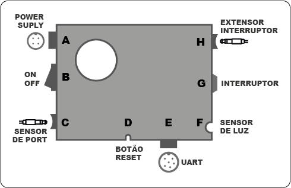
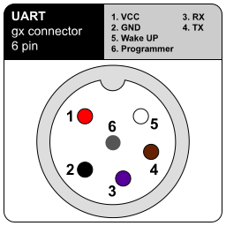
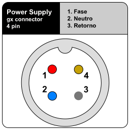

  # Manual - Sensor de porta Despensa

Manual do sensor de porta e iluminação automática da despensa.

## Esquema



### UART


VCC é 5 volts.

### Power Spuly

A entrada de energia deve ser de no máximo 2A.

```IMPORTANTE```: tem que ser 127v - neutro tem que estar presente.



## Segurana, atualização e acesso

Informações coladas na traseira da trampa frontal